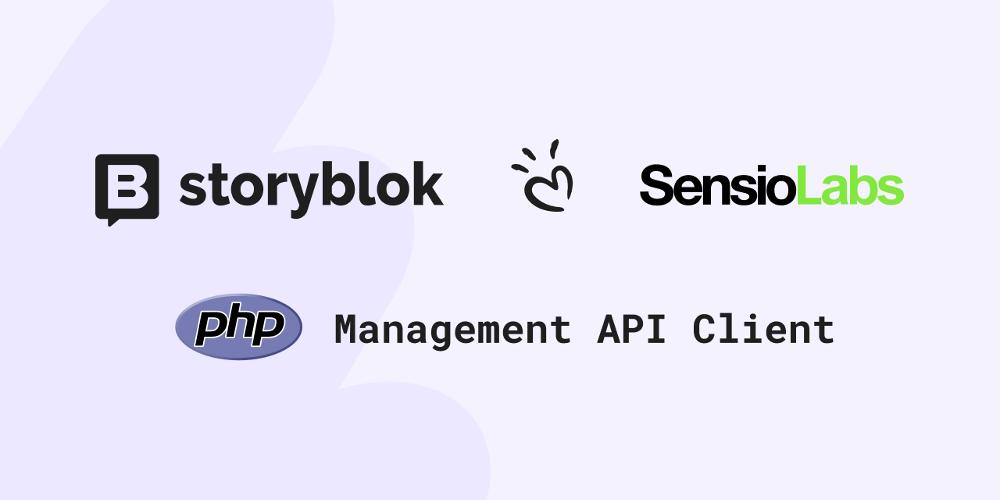

<div align="center">
    
    <h1 align="center">Storyblok Management API PHP Client</h1>
    <p align="center">Co-created with <a href="https://sensiolabs.com/">SensioLabs</a>, the creators of Symfony.</p>
</div>

<p align=center>
    <a href="https://packagist.org/packages/storyblok/php-management-api-client">
        
    </a>
    <a href="https://packagist.org/packages/storyblok/php-management-api-client">
        
    </a>
    <br />
    
    
    
    <br />
        
</p>


The *Storyblok Management API PHP Client* library simplifies the integration with Storyblok's Management API in PHP applications. With easy-to-use methods, you can interact with your Storyblok space effectively.

For the Content API PHP Client, see [storyblok/php-content-api-client](https://github.com/storyblok/php-content-api-client).

## Installation

Install the package via Composer:

```shell
composer require storyblok/php-management-api-client
```

Below is an example showcasing how to use the library to interact with the Management API.

## Initializing the `ManagementApiClient`

Initialize the `ManagementApiClient` with your personal access token to interact with the API:

```php
<?php
require 'vendor/autoload.php';

use Storyblok\ManagementApi\ManagementApiClient;

$client = new ManagementApiClient($storyblokPersonalAccessToken);
```

For using the `ManagementApiClient` class you have to import:

```php
use Storyblok\ManagementApi\ManagementApiClient;
```

### Automatic 429 retry handling

The `ManagementApiClient` supports automatic retry handling when the API returns *HTTP 429 – Too Many Requests*.

To enable this behavior, pass the `shouldRetry` flag when creating the client.
Under the hood, this activates Symfony’s `RetriableHttpClient`, which automatically retries failed requests using a backoff strategy.

```php
<?php
require 'vendor/autoload.php';

use Storyblok\ManagementApi\ManagementApiClient;

$client = new ManagementApiClient(
    personalAccessToken: $storyblokPersonalAccessToken,
    shouldRetry: true
);
```

When enabled:

- Requests returning **429** are retried automatically
- Backoff logic is handled internally by the Symfony HTTP Client
- No custom retry code is required in your application

This feature helps maintain stability when hitting Storyblok API rate limits and reduces the need for manual retry logic.

### Setting the space region

The second optional parameter is for setting the region.

> If you are interested to know more about Storyblok regions, check this FAQ: <https://www.storyblok.com/faq/where-are-your-servers-or-aws-sites-located>

We provide an Enum class to set the region. In this case, you can use the `Region` enum: `Region::US` or `Region::AP` or `Region::CA` or `Region::CN`.

For example, for using the **US** region, you can use:
```php

use \Storyblok\ManagementApi\Data\Enum\Region;

$client = new ManagementApiClient($storyblokPersonalAccessToken, Region::US);
```

## Handling the Personal Access Token
To access the Management API and interact with its endpoints, you need to follow two steps:

- Retrieve a Personal Access Token (or an OAuth token).
- Store the token securely and make it available to your application (e.g., in an environment variable or another secure location).

> The token for accessing the Management API differs from the Access Token used for the Content Delivery API.

To obtain a proper token for accessing the Management API you can choose:

- **Personal Access Token**: Navigate to [your Storyblok account settings](https://app.storyblok.com/#/me/account?tab=token) and click on "Generate new token."
- **OAuth Token**: Follow the steps outlined in [this guide on authentication apps](https://www.storyblok.com/docs/plugins/authentication-apps).

> More information about the Storyblok Management API tokens: <https://www.storyblok.com/docs/api/management/getting-started/authentication>

Once you have your Token, instead of storing the access token directly in the source code, you should consider handling it via environment variables.
For example, you can create the `.env` file (if it does not already exist) and set a parameter for storing the Personal Access Token.

Then, for loading the environment variable, you can use the PHP "dotenv" package:

```php
$dotenv = Dotenv\Dotenv::createImmutable(__DIR__);
$dotenv->load();
$storyblokPersonalAccessToken = $_ENV['SECRET_KEY'];
$client = new ManagementApiClient($storyblokPersonalAccessToken);
```

> The PHP dotenv package is here: <https://github.com/vlucas/phpdotenv>

## Using the Api classes

The Storyblok **Management API Client** provides two main approaches for interacting with the API:

- Using specific API classes (like `StoryApi` or `SpaceApi` or `AssetApi` or `AssetFolderApi` or `InternalTagApi` or `TagApi` or `ExperimentApi` or `UserApi`)
- Using specific API classes for handling bulk data (like `StoryBulkApi`)
- Using the `ManagementApi` class

The `ManagementApi` class offers a flexible, generic interface for managing content. It includes methods to get, create, update, and delete content. With this approach, you can define the endpoint path and pass query string parameters as a generic array. The response is returned as a `StoryblokData` object, allowing you to access the JSON payload, status codes, and other details directly.

Alternatively, you can leverage dedicated classes like `SpaceApi`, which are tailored to specific resources. For instance, the `SpaceApi` class provides methods for managing spaces and returns specialized data objects, such as `Space` (for a single space) or `Spaces` (for a collection of spaces). These classes simplify interactions with specific endpoints by offering resource-specific methods.

If a dedicated API class like `SpaceApi` or `StoryApi` does not exist for your desired endpoint, you can always fall back to the more versatile `ManagementApi` class.

In addition to the general-purpose `ManagementApi` class, the Storyblok Management PHP client also provides specific classes such as `SpaceApi`, `StoryApi`, `TagApi`, `InternalTagApi`, `AssetApi`, `AssetFolderApi`, and `ExperimentApi`. These classes function similarly to the `ManagementApi` but are tailored for specific scenarios, offering additional methods or data types to work with particular resources.

- `SpaceApi` focuses on managing space-level operations, such as retrieving space information, performing backup etc.
- `StoryApi` specializes in handling stories and their content, including creating, updating, retrieving, and deleting stories. This class also provides methods that deal with the structure and fields specific to stories.
- `AssetApi` designed to manage assets like images, files, and other media. It provides methods to upload, retrieve, and manage assets, offering features specific to media management.
- `AssetFolderApi` designed to manage asset folders, including creating, retrieving, updating, and deleting folders for organizing assets.
- `InternalTagApi` designed to manage internal tags for assets and components, including listing, creating, updating, and deleting.
- `TagApi` designed to manage tags.
- `ExperimentApi` designed to retrieve experiments and push experiment results.
- `UserApi` designed to handle the current user. "Current" means the user related to the access token used for instancing the `ManagementApiClient` object.

These specialized classes extend the functionality of the `ManagementApi` class, offering more precise control and optimized methods for interacting with specific resource types in your Storyblok space.

Let's start analyzing the specialized classes, like for example the `SpaceApi`.

## Handling Spaces

For using the `SpaceApi` class you have to import:

```php
use Storyblok\ManagementApi\Endpoints\SpaceApi;
```

For using the `Space` class you have to import:

```php
use Storyblok\ManagementApi\Data\Space;
```

### Retrieve all the spaces

Fetch a list of all spaces associated with your account in the current region (the region is initialized in the `ManagementApiClient`):

```php

$clientEU = new ManagementApiClient($accessToken);
$spaceApi = new SpaceApi($clientEU);
// Retrieve all spaces
$response = $spaceApi->all();
// here you can access to `$response` method if you need
$spaces = $response->data();
// Here you can access to the list of spaces via `$spaces`
```

### Loop through the spaces

Iterate through the list of spaces to access their details:

```php
$clientEU = new ManagementApiClient($accessToken);

$spaceApi = new SpaceApi($clientEU);
$spaces = $spaceApi->all()->data();

$spaces->forEach( function (Space $space) {
    printf("SPACE : %s (%s) - %s - created at: %s as %s" ,
        $space->id(),
        $space->region(),
        $space->name(),
        $space->createdAt(),
        $space->planDescription()
    );
    echo PHP_EOL;

});

```

Both `foreach` and direct index access return the same typed object, so you can use either style:

```php
// foreach — each $space is a Space instance
foreach ($spaces as $space) {
    echo $space->name();
}

// index access — $spaces[0] is also a Space instance
$first = $spaces[0];
echo $first->name();
echo $first->id();
```

The same consistent behavior applies to all typed collections: `Stories` returns `StoryCollectionItem`, `AssetFolders` returns `AssetFolder`, and so on.

### Get one specific Space

Retrieve detailed information about a specific space using its ID:

```php
$spaceId = "12345";
$spaceApi = new SpaceApi($clientEU);
$space = $spaceApi->get($spaceId)->data();

printf(
    "Space ID: %s\n
    Name: %s\n
    Plan: %s (%s)\n
    Domain: %s\n
    Is Demo: %s\n
    First Token: %s\n",
    $spaceId,
    $space->name(),
    $space->planLevel(),
    $space->planDescription(),
    $space->domain(),
    $space->isDemo() ? "yes" : "no",
    $space->firstToken()
);
```

### Activate Storyblok AI

Activate Storyblok AI using configuration specific to the space:

```php
$spaceApi = new SpaceApi($clientEU);
$response = $spaceApi->activateAi($spaceId);
```

### Environments / Preview URLs

Preview URLs allow you to define multiple environments (domains or locations) for quickly switching between different preview targets inside the story editor—such as local development, staging, or production.

#### Listing Environments

You can retrieve all configured environments for a space and iterate through them:

```php
foreach ($space->environments() as $key => $environment) {
    echo "Name: " . $environment->name() . PHP_EOL;
    echo "Location: " . $environment->location() . PHP_EOL;
}
```

#### Adding a New Environment (Preview URL)

To add a new preview environment, create a `SpaceEnvironment` instance and attach it to the space:

```php
$previewEnvironment = new SpaceEnvironment(
    "Local Development",
    $previewURLlocalhost
);

$editSpace->addEnvironment($previewEnvironment);
```

You can repeat this for any number of environments—such as staging, QA, production—allowing editors to switch preview contexts seamlessly.


### Update Space settings

You can edit space settings using the `update()` method. There are two ways to build the `Space` object to send, depending on how many fields you want to change.

#### Full update — rename and reconfigure

Use `new Space($name)` when you want to set the name along with other fields. Every field you set on the object is sent in the request body.

```php
$spaceId = "your-space-id";
$spaceApi = new SpaceApi($client);

// Read current state
$space = $spaceApi->get($spaceId)->data();
/** @var StoryblokData $environments */
$environments = $space->get("environments");
/** @var StoryblokData $languages */
$languages = $space->get("languages");

// Build the update payload — name is included
$editSpace = new Space("Your new space name");
$editSpace->set("domain", "https://your-preview-domain/");

if ($environments->count() === 0) {
    $editSpace->set("environments.0.name", "Demo Local Development");
    $editSpace->set("environments.0.location", "https://localhost:3000/");
}
if ($languages->count() === 0) {
    $editSpace->set("languages.0.code", "it");
    $editSpace->set("languages.0.name", "Italian");
    $editSpace->set("languages.1.code", "de");
    $editSpace->set("languages.1.name", "German");
}

try {
    $spaceApi->update($spaceId, $editSpace);
} catch (Exception $e) {
    echo $e->getMessage();
}
```

#### Partial update — change only specific fields

Use `Space::forUpdate(array $fields)` when you want to send only a subset of fields. The `name` is not included unless you explicitly add it, so the API leaves all other settings untouched.

```php
$spaceApi = new SpaceApi($client);

// Only update the domain — name and all other settings are preserved
$editSpace = Space::forUpdate([
    'domain' => 'https://new-preview-domain/',
]);

$spaceApi->update($spaceId, $editSpace);
```

```php
// Update Dimensions app folder configuration without touching anything else
$editSpace = Space::forUpdate([
    'dimensions_app_folder_ids' => [123, 456, 789],
    'dimensions_app_folders'    => [
        ['folder_id' => 123, 'ai_translation_code' => ''],
        ['folder_id' => 456, 'ai_translation_code' => 'it'],
        ['folder_id' => 789, 'ai_translation_code' => 'de'],
    ],
]);

$spaceApi->update($spaceId, $editSpace);
```

> `new Space()` and `new Space('')` also produce an empty payload (no `name` field), which is fine for partial updates when you add fields via `->set()`. `Space::forUpdate()` is the more explicit and readable choice when you have a known set of fields to send.

### Triggering the backup

Create a backup of a specific space by triggering the backup API:

```php
// Create a backup for a space
try {
    $response = $spaceApi->backup($spaceID);
    if ($response->isOk()) {
        echo "BACKUP DONE!";
    } else {
        echo $response->getErrorMessage() . PHP_EOL;
    }
} catch (Exception $e) {
    echo "Error, " . $e;
}
```

## Handling Stories

For using the `StoryApi` class you have to import:

```php
use Storyblok\ManagementApi\Endpoints\StoryApi;
```

For using the `Story` class you have to import:

```php
use Storyblok\ManagementApi\Data\Story;
```

### Getting the StoryApi instance

To handle Stories, get stories, get a single story, create a story, update a story, or delete a story, you can start getting the instance of StoryApi that allows you to access the methods for handling stories.

```php
use Storyblok\ManagementApi\ManagementApiClient;
use Storyblok\ManagementApi\Endpoints\StoryApi;

$spaceId= "1234";
$client = new ManagementApiClient($storyblokPersonalAccessToken);
$storyApi = new StoryApi($client, $spaceId);
```


### Getting a page of stories

When retrieving a list of stories from a space, the Management API provides paginated results.
By default, each page contains 25 stories, but you can customize the number of stories per page and specify which page to retrieve.

To fetch the first page of stories:

```php
use Storyblok\ManagementApi\Endpoints\StoryApi;

$storyApi = new StoryApi($client, $spaceId);
$stories = $storyApi->page()->data();
foreach ($stories as $story) {
    echo $story->id() . " - " . $story->name() . PHP_EOL;
}
```

Each story item exposes typed accessors for commonly used fields:

```php
foreach ($stories as $story) {
    echo $story->contentType() . PHP_EOL;       // e.g. "article-page"
    echo $story->updatedAt() . PHP_EOL;          // e.g. "2024-02-08"
    echo $story->updatedAt("Y-m-d H:i:s") . PHP_EOL; // e.g. "2024-02-08 16:27:10"

    if ($story->hasUnpublishedChanges()) {
        echo "This story has unpublished draft changes" . PHP_EOL;
    }

    $stageId = $story->workflowStageId();        // int or null
    if ($stageId !== null) {
        echo "Workflow stage ID: " . $stageId . PHP_EOL;
    }
}
```

In the case you need to retrieve the response to access to some additional information you can obtain a `StoriesResponse` via the `page()` method:

```php
$response = $storyApi->page();

echo "STATUS CODE : " . $response->getResponseStatusCode() . PHP_EOL;
echo "LAST URL    : " . $response->getLastCalledUrl() . PHP_EOL;
echo "TOTAL       : " . $response->total() . PHP_EOL;
echo "PAR PAGE    : " . $response->perPage() . PHP_EOL;

$stories = $response->data();
echo "Stories found with the page: " . $stories->howManyStories() . PHP_EOL;
foreach ($stories as $key => $story) {
    echo $story->id() . "  " .
    $story->getName() . PHP_EOL;
}
```

### Filtering stories
You can filter stories using `StoriesParams`.

> The `StoriesParams` attributes are documented in the `Query Parameters` of [Retrieving multiple stories](https://www.storyblok.com/docs/api/management/core-resources/stories/retrieve-multiple-stories)

```php
use Storyblok\ManagementApi\Endpoints\StoryApi;

$storyApi = new StoryApi($client, $spaceId);
$stories = $storyApi->page(
    new StoriesParams(containComponent: "hero-section"),
    page: new PaginationParams(2, 10)
)->data();
echo "Stories found: " . $stories->count();
echo " STORY : " . $stories->get("0.name") . PHP_EOL;

```

### Filtering stories via query filters

Besides using query parameters to filter stories, you can leverage more powerful query filters.

> If you need to handle pagination (retrieving all stories across multiple pages) or create multiple stories at once, you can use the `StoryBulkApi` instead of the `StoryApi` class.

In this example, you will retrieve all stories where the "title" field is empty. (Stories with content types that do not include a "title" field in their schema will be skipped.)

```php
use Storyblok\ManagementApi\Endpoints\StoryBulkApi;
use Storyblok\ManagementApi\QueryParameters\Filters\Filter;
use Storyblok\ManagementApi\QueryParameters\Filters\QueryFilters;

$storyBulkApi = new StoryBulkApi($client, $spaceId);
$stories = $storyBulkApi->all(
    filters: (new QueryFilters())->add(
        new Filter(
            "headline",
            "like",
            "%mars%"
        )
    )
);
foreach ($stories as $story) {
    echo $story->name() . PHP_EOL;
}

```

> Even the "query filters" are documented in the Content Delivery API, you can use the query filters with Management API. Here you can find more examples: https://www.storyblok.com/docs/api/content-delivery/v2/filter-queries/

For retrieving stories with `article-page` content type:

```php
$stories = $storyApi->all(
    filters: (new QueryFilters())->add(
        new Filter(
            "component",
            "in",
            "article-page"
        )
    )
);
foreach ($stories as $story) {
    echo $story->name() . PHP_EOL;
}
```


### Getting a Story by ID

```php
$storyId= "1234";
$story = $storyApi->get($storyId)->data();
echo $story->name() . PHP_EOL;

```

### Creating a Story

To create a story, you can call the `create()` method provided by `StoryApi` and use the `Story` class. The `Story` class is specific for storing and handling story information. It also provides some nice methods for accessing some relevant Story fields.
And because a story stores also the content, you can use the StoryComponent class to handle the fields in the content.

```php
$content = StoryComponent::makeComponent("article-page", [
    "title" => "My New Article",
    "body" => "This is the content",
]);
// $content->setAsset("image", $assetCreated);

$story = new Story(
    name: "A Story",
    slug: "a-story",
    content: $content
);
try{
    $storyCreated = $storyApi->create($story)->data();
    echo "Created Story: " . $storyCreated->id() . " - " . $storyCreated->name() . PHP_EOL;
} catch (ClientException $e) {
    echo "Error while creating story: " . PHP_EOL;
    echo $e->getResponse()->getContent(false);
    echo PHP_EOL;
    echo $e->getMessage();
}
echo PHP_EOL;
```

If you want to publish a story immediately while you are creating it, you can set the second parameter (`publish`) of the `create()` method to `true`:

```php
$storyCreated = $storyApi->create($story, true)->data();
```

If you want to create a story in a specific release, you can set the third parameter (`releaseId`) of the `create()` method:

```php
$storyCreated = $storyApi->create($story, releaseId: $releaseId)->data();
```

#### Setting structured story content values

For simple fields, you can keep using `StoryComponent::set()` with scalar values or raw arrays.
For structured field values, the client also provides small value objects that produce the array shape expected by Storyblok.
Use `StoryComponent::makeComponent()` to create new content blocks. `StoryComponent::make()`
is still reserved for hydrating raw Storyblok payloads that already contain a
`component` key.
Both methods return a `StoryComponent`; the difference is intent: `make()` starts
from an existing payload, while `makeComponent()` starts from a component name
for programmatic creation and fluent setter chains.

```php
use Storyblok\ManagementApi\Data\Fields\MultilinkField;
use Storyblok\ManagementApi\Data\Fields\PluginField;
use Storyblok\ManagementApi\Data\Fields\RichtextField;
use Storyblok\ManagementApi\Data\Fields\TableField;
use Storyblok\ManagementApi\Data\StoryComponent;

$content = StoryComponent::makeComponent("article-page", [
    "title" => "My New Article",
    "body" => RichtextField::paragraph("This is the content"),
]);

$content
    ->setMultilink(
        "cta_link",
        MultilinkField::url("https://example.com")->openInNewTab()
    )
    ->setTable(
        "comparison",
        TableField::fromRows(
            ["Name", "Role"],
            [
                ["Ada", "Engineer"],
                ["Grace", "Scientist"],
            ],
        )
    )
    ->setPlugin(
        "custom_field",
        new PluginField("my-plugin", ["value" => "custom value"])
    );
```

You can also start with only the component name and chain the existing setters:

```php
$hero = StoryComponent::makeComponent("hero")
    ->set("headline", "Hello")
    ->setAssetField("image", $assetField)
    ->setRichtext("body", RichtextField::paragraph("Intro"));
```

The specialized setters are the recommended path for common structured fields,
but they are additive. Existing raw payloads still work, and every content/value
object exposes `get()`, `set()`, `setData()`, and `toArray()` so you can keep
full access to the underlying JSON shape when Storyblok adds new attributes or
when your project needs a payload the typed helpers do not model yet:

```php
$content->set("cta_link", [
    "fieldtype" => "multilink",
    "linktype" => "url",
    "url" => "https://example.com",
    "id" => "",
    "cached_url" => "",
]);

$content->set("comparison", [
    "fieldtype" => "table",
    "thead" => [
        [
            "_uid" => "0affd164-6514-4622-9bd4-67ae69b7ecb8",
            "component" => "_table_head",
            "value" => "Name",
        ],
    ],
    "tbody" => [
        [
            "_uid" => "1bc7d573-a5fe-44aa-8321-d0ef25ce11d4",
            "component" => "_table_row",
            "body" => [
                [
                    "_uid" => "5a7ee79a-94ac-4410-b8a0-7fed9bb07bb7",
                    "component" => "_table_col",
                    "value" => "Ada",
                ],
            ],
        ],
    ],
]);

$rawContent = $content->toArray();
```

### Creating a Folder

Stories in Storyblok can be organized into folders. A folder is a story with `is_folder` set to `true`. You can also set a default content type and restrict which content types are allowed inside the folder.

#### Shortcut: `StoryApi::createFolder()`

The quickest way to create a folder is `StoryApi::createFolder()`. It mirrors the fields of the Storyblok UI "Create folder" dialog:

| Parameter                     | UI label                              | Default                           |
| ----------------------------- | ------------------------------------- | --------------------------------- |
| `name`                        | Name (mandatory)                      | —                                 |
| `slug`                        | Slug                                  | auto-generated from `name`        |
| `parentId`                    | Parent folder                         | `0` (root)                        |
| `defaultContentType`          | Default content type                  | `null`                            |
| `contentTypes`                | Specific content types (whitelist)    | `[]` (all types allowed)          |
| `lockSubfoldersContentTypes`  | Lock sub-folders content-type change  | `false`                           |
| `disableFeEditor`             | Disable visual editor                 | `false`                           |

```php
$created = $storyApi->createFolder(
    name: "Articles",
    defaultContentType: "article-page",
    contentTypes: ["article-page", "landing-page"],
    lockSubfoldersContentTypes: true,
)->data();

echo "Created folder: " . $created->id() . " - " . $created->name() . PHP_EOL;
echo "Is folder: " . ($created->isFolder() ? "yes" : "no") . PHP_EOL;
```

To create a subfolder, pass the parent folder ID:

```php
$storyApi->createFolder(
    name: "Tech Articles",
    parentId: (int) $created->id(),
);
```

#### Object-oriented approach

If you need to compose additional fields (tags, metadata, etc.) before sending, use `Story::asFolder()` and then `StoryApi::create()`:

```php
$folder = Story::asFolder(
    name: "Articles",
    defaultContentType: "article-page",
    contentTypes: ["article-page", "landing-page"],
    lockSubfoldersContentTypes: true,
);
$folder->setTagsFromArray(["editorial"]);

$created = $storyApi->create($folder)->data();
```

You can also build the folder manually with `new Story(...)` plus `setIsFolder()`, `setDefaultRoot()`, `setFolderId()`, `setDisableFeEditor()`, and the `StoryComponent` setters `setContentTypes()` / `setLockSubfoldersContentTypes()`.

### Publishing a story

For publishing a story by the story identifier you can use the `publish` method:

```php
$storyApi->publish($storyId);
```

### Update a Story

Updates an existing story using the Storyblok Management API.

#### Method Signature

```php
$storyApi->update(
    string $storyId,
    Story $storyData,
    string $groupId = "",
    string $forceUpdate = "",
    int $releaseId = 0,
    bool $publish = false,
    string $lang = ""
): StoryResponse
```

#### Parameters

- **`storyId`** (`string`)
  The ID of the story to update.

- **`storyData`** (`Story`)
  The Story object containing updated content and metadata.

- **`groupId`** (`string`, optional)
  Group ID (UUID string) shared between stories defined as alternates.

- **`forceUpdate`** (`string`, optional)
  Set to `"1"` to force an update of a locked story.
  A story is locked when another user edits it. Forcing an update may cause content conflicts and has no effect if the story is locked due to a workflow stage.

- **`releaseId`** (`int`, optional)
  Numeric ID of the release in which the story should be updated.

- **`publish`** (`bool`, optional)
  Set to `true` to publish the story immediately after updating it.

- **`lang`** (`string`, optional)
  Language code to update or publish the story individually.
  The language must be enabled in **Settings → Internationalization**.                           |

#### Examples

Update a story:

```php
$storyApi->update(
    storyId: '123456',
    storyData: $story
);
```

Update fields inside the story content payload:

```php
$story = $storyApi->get('123456')->data();

$story
    ->setContentField("headline", "Updated headline")
    ->setContentField("categories", [$categoryUuid]);

echo $story->getContentField("headline");

$storyApi->update(
    storyId: '123456',
    storyData: $story
);
```

`setContentField()` and `getContentField()` use paths relative to `content`.
For full story-level updates, you can still use `set()` with dot notation.

Update and publish immediately:

```php
$storyApi->update(
    storyId: '123456',
    storyData: $story,
    publish: true
);
```

Update a specific language:

```php
$storyApi->update(
    storyId: '123456',
    storyData: $story,
    lang: 'de'
);
```

Force update a locked story:

```php
$storyApi->update(
    storyId: '123456',
    storyData: $story,
    forceUpdate: '1'
);
```

### Creating stories from large CSV files (streamed, memory-efficient)
When importing stories from a CSV file, especially very large ones, one of the approaches is to stream the CSV file using generators and create stories one by one using the Management API client. This keeps memory usage low and allows the client’s built-in retry logic to gracefully handle potential 429 Too Many Requests responses, which can occur multiple times when processing large CSV files.

Example CSV file (`stories.csv`):

```csv
myslug-001;My Story 1 BULK;page
myslug-002;My Story 2 BULK;page
myslug-003;My Story 3 BULK;page
...
```

#### Streaming the CSV file with a generator

Instead of reading the entire file into an array, you can use a generator to yield one row at a time:

```php
function csvGenerator(string $filePath, string $delimiter = ";"): Generator
{
    $file = new SplFileObject($filePath);
    $file->setFlags(
        SplFileObject::READ_CSV |
            SplFileObject::SKIP_EMPTY |
            SplFileObject::DROP_NEW_LINE,
    );
    $file->setCsvControl($delimiter, escape: "\\");

    foreach ($file as $row) {
        if (!$row || count($row) < 3) {
            continue;
        }

        yield $row;
    }
}

```

#### Creating stories line-by-line

Each CSV row is converted into a `Story` and sent immediately to the Storyblok Management API. This avoids large in-memory arrays and ensures that retries for `429` responses are handled cleanly per request.

```php
<?php

use Storyblok\ManagementApi\Data\Story;
use Storyblok\ManagementApi\Data\StoryComponent;
use Storyblok\ManagementApi\Endpoints\StoryApi;
use Storyblok\ManagementApi\ManagementApiClient;

require "./vendor/autoload.php";

$dotenv = Dotenv\Dotenv::createImmutable(__DIR__);
$dotenv->load();
$storyblokPersonalAccessToken = $_ENV["SECRET_KEY"];

// `shouldRetry` helps to automatically manage 429 - Rate Limits
$client = new ManagementApiClient(
    personalAccessToken: $storyblokPersonalAccessToken,
    shouldRetry: true,
);

$spaceId = "your-space-id";
$storyApi = new StoryApi($client, $spaceId);

function csvGenerator(string $filePath, string $delimiter = ";"): Generator
{
    $file = new SplFileObject($filePath);
    $file->setFlags(
        SplFileObject::READ_CSV |
            SplFileObject::SKIP_EMPTY |
            SplFileObject::DROP_NEW_LINE,
    );
    $file->setCsvControl($delimiter, escape: "\\");

    foreach ($file as $row) {
        if (!$row || count($row) < 3) {
            continue;
        }

        yield $row;
    }
}

foreach (csvGenerator("stories.csv") as $row) {
    [$slug, $name, $contentType] = $row;

    try {
        $story = new Story(
            name: $name,
            slug: $slug,
            content: new StoryComponent($contentType),
        );

        // Create the story immediately
        $storyApi->create($story);

        echo "Created story: {$slug}\n";
    } catch (Throwable $e) {
        // Continue processing even if a single row fails
        echo "Failed to create story '{$slug}': {$e->getMessage()}\n";
    }
}

```

#### Benefits of this approach

- **Low memory footprint**
   The CSV file is streamed line-by-line, making this approach suitable for very large imports.
- **Better resilience to rate limits**
   Each request is handled individually, allowing the Management API client to retry automatically when `429 Too Many Requests` responses occur, even multiple times during large imports.
- **Better flow control**
   Better control of the flow, which can be stopped or continued, if a single invalid row or API error occurs.

This approach is recommended when working with large datasets or when reliability and controlled API usage are critical.

### Getting story versions

You can retrieve versions of a story using the `versions()` method. The story ID is required as the first parameter:

```php
$response = $storyApi->versions("174957");

$versions = $response->data();
echo $versions->howManyVersions(); // number of versions returned

foreach ($versions as $version) {
    echo $version->id();
    echo $version->status();
    echo $version->createdAt();
    echo $version->friendlyName(); // author's friendly name
}
```

You can also filter by release ID, include content, and paginate:

```php
use Storyblok\ManagementApi\QueryParameters\StoryVersionsParams;
use Storyblok\ManagementApi\QueryParameters\PaginationParams;

$response = $storyApi->versions(
    "174957",
    new StoryVersionsParams(
        byReleaseId: 100,
        showContent: true,
    ),
    new PaginationParams(page: 1, perPage: 10),
);
```

> **Note:** This endpoint returns versions created after August 28, 2024. Older versions require the legacy endpoint.

## Handling components

You can use the `ComponentApi` class to fetch all components from a specific space:

```php
use Storyblok\ManagementApi\ManagementApiClient;
use Storyblok\ManagementApi\Api\ComponentApi;
use Psr\Log\NullLogger;

$client = new ManagementApiClient($storyblokPersonalAccessToken);

// Define your space ID
$spaceId = "YOUR_SPACE_ID";

// Initialize the Component API
$componentApi = new ComponentApi($client, $spaceId, new NullLogger());

// Retrieve all components
$componentsResponse = $componentApi->all();
$components = $componentsResponse->data();

// Loop through and print component names and IDs
foreach ($components as $component) {
    echo $component->name() . " - " . $component->id() . PHP_EOL;
}

```

Each component has a type based on the `is_root` and `is_nestable` flags. You can use the helper methods `isContentType()`, `isNestable()`, `isUniversal()`, or `getComponentTypeDetail()` to determine the component type:

```php
foreach ($components as $component) {
    // returns "content-type", "nestable", "universal", or ""
    echo $component->name() . " - " . $component->getComponentTypeDetail() . PHP_EOL;
}
```

When creating components, you can use named constructors for the common flag
combinations:

| Constructor | Flags |
|---|---|
| `Component::contentType("article")` | `is_root: true`, `is_nestable: false` |
| `Component::nestable("teaser")` | `is_root: false`, `is_nestable: true` |
| `Component::universal("section")` | `is_root: true`, `is_nestable: true` |

With the same response you can retrieve the component folders.
You can use the `dataFolders()` method:

```php
$folders = $componentsResponse->dataFolders();
```


### Creating a new component

You can programmatically create a new component in a space using typed field classes and a fluent interface.
Mutating methods return the same instance, so existing one-call usage and chained calls are both supported.

Each field class sets its own type automatically, so you only need to provide the field key and any attributes you want to configure via chained setters:

```php
use Storyblok\ManagementApi\Data\Component;
use Storyblok\ManagementApi\Data\Fields\Schema\FieldText;
use Storyblok\ManagementApi\Data\Fields\Schema\FieldRichtext;
use Storyblok\ManagementApi\Data\Fields\Schema\FieldAsset;
use Storyblok\ManagementApi\Data\Fields\Schema\FieldBoolean;
use Storyblok\ManagementApi\Data\Fields\Schema\FieldNumber;
use Storyblok\ManagementApi\Data\Fields\Schema\FieldBloks;
use Storyblok\ManagementApi\Data\Fields\Schema\FieldOption;
use Storyblok\ManagementApi\Data\Fields\Schema\OptionValue;

$component = Component::contentType("my-component")
    ->setDisplayName("My Component")
    ->setPreviewField("headline")
    ->appendFields([
        FieldText::make("headline")
            ->setDisplayName("Headline")
            ->setRequired()
            ->setTranslatable(),
        FieldRichtext::make("description")
            ->setDisplayName("Description")
            ->setTranslatable()
            ->setToolbar(["bold", "italic", "link"]),
        FieldAsset::make("image")
            ->setDisplayName("Image"),
        FieldOption::make("category")
            ->setDisplayName("Category")
            ->setOptions([
                OptionValue::make("News", "news"),
                OptionValue::make("Product", "product"),
            ]),
    ]);

try {
    $componentResponse = $componentApi->create($component);
    $newComponent = $componentResponse->data();
    echo "Component created with ID: " . $newComponent->id() . PHP_EOL;
} catch (Exception $e) {
    echo "Error creating component: " . $e->getMessage();
}
```

You can still use `new FieldText("headline")` if you prefer constructors. The
`FieldText::make("headline")` form is a named constructor that returns the same
specialized field object and is convenient for fluent chains.

All shared field properties are available on every field type via `FieldGeneric`:

| Setter | Description |
|---|---|
| `setPos(int $pos)` | Position in the editor |
| `setDisplayName(string $name)` | Label shown in the editor |
| `setRequired(bool $required = true)` | Mark the field as required |
| `setTranslatable(bool $translatable = true)` | Enable per-language translation |
| `setNoTranslate(bool $noTranslate = true)` | Exclude from translation |
| `setDescription(string $description)` | Helper text shown below the field |
| `setTooltip(bool $tooltip = true)` | Show description as a tooltip |

Each specialized class adds its own setters:

| Class | Setters |
|---|---|
| `FieldText` | `setDefaultValue()`, `setRegex()` |
| `FieldTextarea` | `setDefaultValue()`, `setRegex()` |
| `FieldMarkdown` | `setDefaultValue()` |
| `FieldDatetime` | `setDefaultValue()` |
| `FieldNumber` | `setDefaultValue()`, `setMinValue()`, `setMaxValue()` |
| `FieldBoolean` | `setDefaultValue()`, `setInlineLabel()`, `setCheckboxLabel()` |
| `FieldOption` | `setOptions()`, `addOption()`, `addOptionValue()`, `setSource()`, `setDatasourceSlug()`, `setDefaultValue()` |
| `FieldOptions` | `setOptions()`, `addOption()`, `addOptionValue()`, `setSource()`, `setDatasourceSlug()` |
| `FieldRichtext` | `setToolbar()`, `setRestrictComponents()`, `setComponentWhitelist()` |
| `FieldBloks` | `setMinimum()`, `setMaximum()`, `setComponentWhitelist()` |
| `FieldAsset` | `setFiletypes()` |
| `FieldMultiasset` | `setFiletypes()` |
| `FieldMultilink` | `setLinkTypes()`, `setAllowTargetBlank()` |
| `FieldPlugin` | `setPlugin()` / `setFieldType()` |
| `FieldTable` | shared setters only |
| `FieldSection` | shared setters only |

Unknown field types and future Storyblok schema attributes are still supported through `FieldGeneric`, `get()`, and `toArray()`.
For plugin/custom fields, `FieldPlugin` creates the component schema shape expected by Storyblok: `type: custom` and `field_type: your-plugin-name`.

For option fields, `OptionValue` avoids having to remember the raw array shape:

```php
use Storyblok\ManagementApi\Data\Fields\Schema\FieldOption;
use Storyblok\ManagementApi\Data\Fields\Schema\FieldOptions;
use Storyblok\ManagementApi\Data\Fields\Schema\OptionValue;

FieldOption::make("category")
    ->addOption("Developers", "developers")
    ->addOption("Editors", "editors");

FieldOptions::make("audiences")
    ->setOptions([
        OptionValue::make("Developers", "developers"),
        OptionValue::make("Editors", "editors"),
    ]);
```

Raw option arrays are still supported:

```php
FieldOption::make("category")->setOptions([
    ["name" => "Developers", "value" => "developers"],
]);
```

If you prefer passing raw arrays, the existing `setField()` method still works
and can be chained like the other component mutators:

```php
$component
    ->setSchema([])
    ->setField("title", ["type" => "text", "pos" => 0]);
```

### Adding a field to an existing component

There are four helpers for adding schema fields. The difference is how much they
manage `pos` for you:

- `addField()` adds one field and does not touch `pos`.
- `addFields()` adds multiple fields and does not touch `pos`.
- `appendField()` adds one field at the end by setting `pos` to `maxPos() + 1`.
- `appendFields()` adds multiple fields at the end, preserving the array order.

The `append*` methods do not make additional API calls. They calculate the next
position from the schema already loaded in the `Component` object. This means
they do a local scan of the current schema entries. Use `addField()` or
`addFields()` when you want to let Storyblok assign positions, or when you
already set explicit positions yourself.

Use `addField()` when position does not matter. Fetch the component, add the field, save it back. Storyblok assigns the position automatically if no `pos` is present.

```php
use Storyblok\ManagementApi\Data\Fields\Schema\FieldText;

$component = $componentApi->get($componentId)->data();

$component->addField(
    FieldText::make("summary")
        ->setDisplayName("Summary")
        ->setTranslatable()
);

$componentApi->update($componentId, $component);
```

Use `addFields()` for the same behavior with multiple fields. It does not set,
calculate, or shift `pos`; if a field already has `setPos()`, that explicit
value is preserved.

```php
$component->addFields([
    FieldText::make("summary")->setDisplayName("Summary"),
    FieldText::make("subtitle")->setDisplayName("Subtitle")->setPos(10),
]);
```

If you already know the exact positions, set them on each field. `addFields()`
will keep those values as-is and will not move existing fields out of the way:

```php
$component->addFields([
    FieldText::make("summary")
        ->setDisplayName("Summary")
        ->setPos(3),
    FieldText::make("subtitle")
        ->setDisplayName("Subtitle")
        ->setPos(4),
]);
```

Use `insertField()` when position matters. It shifts every existing schema entry (fields and tabs alike) at `pos >= $atPos` up by one before inserting the new field. This keeps all `pos` values consistent without you having to manage the shift manually.

```php
use Storyblok\ManagementApi\Data\Fields\Schema\FieldText;

$component = $componentApi->get($componentId)->data();

$component->insertField(
    FieldText::make("summary")->setDisplayName("Summary"),
    atPos: 0,
);

$componentApi->update($componentId, $component);
```

### Finding the next available position

When you build a component schema programmatically, you often need to know where the current schema ends so you can append a new field without gaps or collisions. `maxPos()` returns the highest `pos` value across all schema entries, fields and tabs alike. Returns `-1` when the schema is empty.

```php
$component = $componentApi->get($componentId)->data();

$next = $component->maxPos() + 1;

$component->addField(
    (new FieldText("summary"))
        ->setPos($next)
        ->setDisplayName("Summary")
);
```

Without `maxPos()` you would have to iterate the schema yourself to find the current ceiling before adding a field with an explicit position. This matters when you call `addField()` with `setPos()` set explicitly, as opposed to letting Storyblok assign the position server-side.

For the common case of appending at the end, `appendField()` and `appendFields()` handle this automatically, so you do not need to call `maxPos()` directly.

| Method | When to use |
|---|---|
| `appendField($field)` | Add one field after all existing entries by calculating the next `pos` locally |
| `appendFields([$fieldA, $fieldB])` | Add multiple fields after all existing entries, preserving array order and calculating each next `pos` locally |
| `insertField($field, atPos: $n)` | Insert a field at a specific position, shifting everything else |
| `addField($field)` | Add a field without touching `pos` (let Storyblok assign it server-side) |
| `addFields([$fieldA, $fieldB])` | Add multiple fields without touching `pos` |

### Appending a field at the end

`appendField()` computes `maxPos() + 1` from the current in-memory schema and assigns that as the field's `pos` before adding it. `appendFields()` repeats that process for each field in the array order. No existing entries are shifted, and no extra API request is made.

If the field already has a `pos` from `setPos()`, the `append*` methods
override it with the calculated append position. Use `addField()` or
`addFields()` when you want to preserve explicit `setPos()` values.

```php
$component = $componentApi->get($componentId)->data();

$component->appendFields([
    FieldText::make("summary")->setDisplayName("Summary"),
    FieldRichtext::make("body")->setDisplayName("Body"),
]);

$componentApi->update($componentId, $component);
```

For example, if the current highest `pos` is `2`, the first field passed to
`appendFields()` gets `pos: 3`, the second gets `pos: 4`, and so on:

```php
$component->appendFields([
    FieldText::make("summary")->setDisplayName("Summary"), // pos: 3
    FieldRichtext::make("body")->setDisplayName("Body"),   // pos: 4
]);
```

`maxPos()` and `insertField()` are complementary. Use `appendField()` (or `maxPos() + 1` directly) to add at the end; use `insertField($field, atPos: $n)` to insert in the middle.

### Reading a component schema

A component's schema describes its fields. The `Component` class provides two ways to read it, depending on what you need.

#### `getSchema()` — raw API data

Use `getSchema()` when you need the exact structure returned by the API. It includes every entry, tabs and fields alike, in no guaranteed order. Each entry is a plain array.

```php
$component = $componentApi->get($componentId)->data();

$schema = $component->getSchema();
// Returns the raw schema array, e.g.:
// [
//   'title'    => ['type' => 'text', 'pos' => 0, ...],
//   'tab-seo'  => ['type' => 'tab', 'display_name' => 'SEO', 'keys' => [...], 'pos' => 1, ...],
//   'meta'     => ['type' => 'text', 'pos' => 2, ...],
// ]
```

This is the right choice when you need to pass the schema back to the API or inspect fields the library does not model explicitly.

#### `getFields()` — typed, sorted, tabs excluded

Use `getFields()` when you want to work with the fields themselves. It returns only non-tab entries, sorted by `pos`, each wrapped in a typed `FieldInterface` object with named accessors.

```php
$fields = $component->getFields();

foreach ($fields as $key => $field) {
    echo $field->key() . PHP_EOL;          // e.g. "title"
    echo $field->type() . PHP_EOL;         // e.g. "text"
    echo $field->pos() . PHP_EOL;          // e.g. 0
    echo $field->displayName() . PHP_EOL;  // e.g. "Title"
    echo $field->required() . PHP_EOL;     // e.g. true
    echo $field->translatable() . PHP_EOL; // e.g. false
}
```

To retrieve only the fields that belong to a specific tab, pass the tab's display name:

```php
$seoFields = $component->getFields('SEO');
```

Specialized field types expose additional accessors. The factory in `FieldGeneric::make()` returns the correct subclass automatically.

```php
use Storyblok\ManagementApi\Data\Fields\Schema\FieldText;
use Storyblok\ManagementApi\Data\Fields\Schema\FieldTextarea;
use Storyblok\ManagementApi\Data\Fields\Schema\FieldMarkdown;
use Storyblok\ManagementApi\Data\Fields\Schema\FieldDatetime;
use Storyblok\ManagementApi\Data\Fields\Schema\FieldNumber;
use Storyblok\ManagementApi\Data\Fields\Schema\FieldBoolean;
use Storyblok\ManagementApi\Data\Fields\Schema\FieldOption;
use Storyblok\ManagementApi\Data\Fields\Schema\FieldOptions;
use Storyblok\ManagementApi\Data\Fields\Schema\FieldRichtext;
use Storyblok\ManagementApi\Data\Fields\Schema\FieldBloks;
use Storyblok\ManagementApi\Data\Fields\Schema\FieldAsset;
use Storyblok\ManagementApi\Data\Fields\Schema\FieldMultilink;
use Storyblok\ManagementApi\Data\Fields\Schema\FieldMultiasset;
use Storyblok\ManagementApi\Data\Fields\Schema\FieldPlugin;

foreach ($component->getFields() as $field) {
    if ($field instanceof FieldText) {
        echo $field->defaultValue() . PHP_EOL;
        echo $field->regex() . PHP_EOL;
    }

    if ($field instanceof FieldTextarea) {
        echo $field->defaultValue() . PHP_EOL;
        echo $field->regex() . PHP_EOL;
    }

    if ($field instanceof FieldMarkdown || $field instanceof FieldDatetime) {
        echo $field->defaultValue() . PHP_EOL;
    }

    if ($field instanceof FieldNumber) {
        echo $field->minValue() . PHP_EOL;
        echo $field->maxValue() . PHP_EOL;
    }

    if ($field instanceof FieldBoolean) {
        echo $field->inlineLabel() . PHP_EOL;
        echo $field->checkboxLabel() . PHP_EOL;
    }

    if ($field instanceof FieldOption || $field instanceof FieldOptions) {
        echo $field->source() . PHP_EOL;
        echo $field->datasourceSlug() . PHP_EOL;
        print_r($field->options());
    }

    if ($field instanceof FieldRichtext) {
        echo implode(', ', $field->toolbar()) . PHP_EOL;
        echo $field->restrictComponents() . PHP_EOL;
        echo implode(', ', $field->componentWhitelist()) . PHP_EOL;
    }

    if ($field instanceof FieldBloks) {
        echo $field->minimum() . PHP_EOL;
        echo $field->maximum() . PHP_EOL;
        echo implode(', ', $field->componentWhitelist()) . PHP_EOL;
    }

    if ($field instanceof FieldAsset || $field instanceof FieldMultiasset) {
        echo implode(', ', $field->filetypes()) . PHP_EOL;
    }

    if ($field instanceof FieldMultilink) {
        echo implode(', ', $field->linkTypes()) . PHP_EOL;
        echo $field->allowTargetBlank() . PHP_EOL;
    }

    if ($field instanceof FieldPlugin) {
        echo $field->plugin() . PHP_EOL;
    }
}
```

For field types not covered by a specialized class, `getFields()` returns a `FieldGeneric` instance, which still provides the shared accessors from `FieldInterface`.

#### Accessing attributes not covered by typed methods

Every field object exposes a `get()` method for reading any raw attribute by name. Use it when the specialized class does not have a dedicated method for the attribute you need.

```php
foreach ($component->getFields() as $field) {
    // works on any field type, returns null when the attribute is absent
    $maxLength = $field->get('max_length');

    // provide a default for missing attributes
    $toolbar = $field->get('toolbar', []);

    // access nested attributes using dot notation
    $firstOption = $field->get('options.0.value');
}
```

#### Listing tabs

Use `getTabs()` to get the tab entries, sorted by `pos`:

```php
$tabs = $component->getTabs();

foreach ($tabs as $key => $tab) {
    echo $tab['display_name'] . PHP_EOL; // e.g. "SEO"
}
```

To find which tab a field belongs to:

```php
$tabName = $component->getFieldTab('meta_title'); // e.g. "SEO", or null
```

#### Quick reference

| Method | Returns | Tabs included | Ordered by pos | Typed objects |
|---|---|---|---|---|
| `getSchema()` | `array<string, array<mixed>>` | yes | no | no |
| `getFields()` | `array<string, FieldInterface>` | no | yes | yes |
| `getTabs()` | `array<string, array<mixed>>` | only tabs | yes | no |

## Handling users

For using the `UserApi` class you have to import:

```php
use Storyblok\ManagementApi\Endpoints\UserApi;
```

For using the `User` class you have to import:

```php
use Storyblok\ManagementApi\Data\User;
```


### Getting the current user

To get the current user, owner of the Personal access token used you can use the `UserApi` class for calling endpoints and the `User` for accessing to returned data object properties.
For example, here we want to retrieve the current user (via the `me()` method) and obtaining the `User` object via `data()`.

```php
use Storyblok\ManagementApi\Endpoints\UserApi;
use Storyblok\ManagementApi\ManagementApiClient;

$client = new ManagementApiClient(getAccessToken());

$currentUser = (new UserApi($client))->me()->data();
// "User ID"
echo $currentUser->id() . PHP_EOL;
// "User identifier"
echo $currentUser->userid() . PHP_EOL;
// "User email"
echo $currentUser->email() . PHP_EOL;
// "User has Organization"
echo ($currentUser->hasOrganization() ? " HAS ORG:" . $currentUser->orgName() : "NO ORG") . PHP_EOL;
// "User has Partner"
echo ($currentUser->hasPartner() ? " HAS PARTNER" : "NO PARTNER") . PHP_EOL;;

```

Typically, all the data object provides you some helper methods like:
- `toArray()` to obtain the data in a PHP array;
- `toJson()` to obtain a JSON string;
- `dump()` for debugging purposes, it prints on standard output the indented JSON.

## Handling assets

For using the `AssetApi` class you have to import:

```php
use Storyblok\ManagementApi\Endpoints\AssetApi;
```

For using the `Asset` class you have to import:

```php
use Storyblok\ManagementApi\Data\Asset;
```

### Getting the AssetApi instance

To handle assets, get assets, get a single asset, upload an asset, update an asset, or delete an asset, you can start getting the instance of AssetApi that allows you to access the methods for handling assets.

```php
use Storyblok\ManagementApi\ManagementApiClient;
$client = new ManagementApiClient($storyblokPersonalAccessToken);

$spaceId = "spaceid";
$assetApi = new AssetApi($client, $spaceId);
```

### Getting the assets list

To get the assets list you can use the `assetApi` and the `AssetsData`.

```php
$assetApi = new AssetApi($client, $spaceId);
$assets = $assetApi->page()->data();

foreach ($assets as $key => $asset) {
    echo $asset->id() . PHP_EOL;
    echo $asset->contentType() . PHP_EOL;
    echo $asset->contentLength() . PHP_EOL;
    echo $asset->filenameCDN() . PHP_EOL;
    echo "---" . PHP_EOL;
}
```

### Filtering assets

Using the `AssetsParams` class you can set up filters for filtering the assets.

```php
use Storyblok\ManagementApi\QueryParameters\{AssetsParams,PaginationParams};

$assetApi = new AssetApi($client, $spaceId);
$assets = $assetApi->page(
    new AssetsParams(
        inFolder: -1,
        search: "something"
    ),
    new PaginationParams(1,1000)
)->data();
```

In the example above, we are filtering the deleted assets (`inFolder : -1`) and with the filename that contains the term `something`.
Additional info: using `PaginationParams` you can retrieve a specific page. The example `new PaginationParams(1,1000)` retrieves the page number `1` and `1000` items per page.

### Getting one asset

To get a specific asset, you can use the `AssetApi` and the `AssetData` classes.

```php
$asset = $assetApi->get($assetId)->data();
echo $asset->id() . PHP_EOL;
echo $asset->contentType() . PHP_EOL;
echo $asset->contentLength() . PHP_EOL;
echo $asset->filenameCDN() . PHP_EOL;
echo $asset->filename() . PHP_EOL;
echo "---" . PHP_EOL;
```

### Uploading an Asset

To upload an asset, you can use the `upload()` method:

```php
$assetCreated = $assetApi->upload("image.png")->data();

echo "Asset created, ID: " . $assetCreated->id() . PHP_EOL;
echo "         filename: " . $assetCreated->filename() . PHP_EOL;
echo "     filename CDN: " . $assetCreated->filenameCDN() . PHP_EOL;
```

### Updating an Asset

To update an asset's metadata (alt text, title, folder, internal tags, etc.), you can use the `update()` method:

```php
$asset = $assetApi->get($assetId)->data();
$asset->set("alt", "A landscape photo");
$asset->set("title", "Landscape");
$asset->set("asset_folder_id", $folderId);
$asset->set("internal_tag_ids", [10, 20]);

$updatedAsset = $assetApi->update($assetId, $asset)->data();
echo "Updated asset, ID: " . $updatedAsset->id() . PHP_EOL;
```

### Converting an Asset to the Global Assets Library

To convert a space-local asset into the global assets library, use the `convert()` method.
This operation is one-way: it moves the asset from the space assets library to the organization/global assets library.
The target folder ID must be a folder in the global assets library.
The source space must also be added to the allowed spaces list in the shared library settings; otherwise the API can return a permission error even if your account can upload assets through the UI.

```php
$assetId = "111";
$targetAssetFolderId = "777";

$convertedAsset = $assetApi->convert($assetId, $targetAssetFolderId)->data();

echo "Converted asset, ID: " . $convertedAsset->id() . PHP_EOL;
echo "Space ID: " . var_export($convertedAsset->get("space_id"), true) . PHP_EOL;
```

### Deleting an Asset

To delete an asset, you can use the `delete()` method. The `delete()` method requires the asset ID (you want to delete) as parameter:

```php
$assetApi = new AssetApi($client, $spaceId);
echo "DELETING " . $assetId . PHP_EOL;
$deletedAsset = $assetApi->delete($assetId)-data();
echo "DELETED ASSET, ID : " . $deletedAsset->id() . PHP_EOL;
```


### Deleting Multiple Assets

To delete multiple assets, you can use the `deleteMultipleAssets()` method. It requires an array of asset ID strings as parameter:

```php
$response = $assetApi->deleteMultipleAssets($ids);
```

On success, the response will have a `200` status code.

Here is a more complete example that queries assets by tag, retrieves their IDs, and deletes them:

```php
$assetApi = new AssetApi($client, $spaceId);
$tags = ["some-tag"];
$params = [
    "withTags" => $tags,
];
$assets = $assetApi->page(new AssetsParams(...$params))->data();
$ids = $assets->getIds();

echo "Going to delete: " . implode(", ", $ids) . PHP_EOL;
try {
    $response = $assetApi->deleteMultipleAssets($ids);
    echo "Status: " . $response->getResponseStatusCode() . PHP_EOL;
    echo $response->data()->message();
} catch (Exception $e) {
    echo "Error deleting: " . $e->getMessage() . PHP_EOL;
}
```

## Handling asset folders

For using the `AssetFolderApi` class you have to import:

```php
use Storyblok\ManagementApi\Endpoints\AssetFolderApi;
```

For using the `AssetFolder` class you have to import:

```php
use Storyblok\ManagementApi\Data\AssetFolder;
```

### Getting the AssetFolderApi instance

```php
$assetFolderApi = new AssetFolderApi($client, $spaceId);
```

### Listing asset folders

```php
$folders = $assetFolderApi->page()->data();

foreach ($folders as $folder) {
    echo $folder->id() . PHP_EOL;
    echo $folder->name() . PHP_EOL;
    echo $folder->parentId() . PHP_EOL;
}
```

### Getting one asset folder

```php
$folder = $assetFolderApi->get($folderId)->data();
echo $folder->id() . PHP_EOL;
echo $folder->name() . PHP_EOL;
```

### Creating an asset folder

```php
$folder = new AssetFolder("My New Folder");
$created = $assetFolderApi->create($folder)->data();
echo "Created folder, ID: " . $created->id() . PHP_EOL;
```

To create a subfolder, set the `parent_id`:

```php
$folder = new AssetFolder("Subfolder");
$folder->set("parent_id", $parentFolderId);
$created = $assetFolderApi->create($folder)->data();
```

### Updating an asset folder

```php
$folder = $assetFolderApi->get($folderId)->data();
$folder->set("name", "Renamed Folder");
$updated = $assetFolderApi->update($folderId, $folder)->data();
```

### Deleting an asset folder

```php
$assetFolderApi->delete($folderId);
```

## Handling internal tags

Internal tags are used to organize assets and components within Storyblok. They differ from story tags (`TagApi`) and are managed through the `/internal_tags` endpoint.

For using the `InternalTagApi` class you have to import:

```php
use Storyblok\ManagementApi\Endpoints\InternalTagApi;
```

For using the `InternalTag` class you have to import:

```php
use Storyblok\ManagementApi\Data\InternalTag;
```

### Getting the InternalTagApi instance

```php
$internalTagApi = new InternalTagApi($client, $spaceId);
```

### Listing internal tags

```php
use Storyblok\ManagementApi\QueryParameters\InternalTagsParams;

$tags = $internalTagApi->page(
    new InternalTagsParams(byObjectType: "asset"),
)->data();

foreach ($tags as $tag) {
    echo $tag->id() . PHP_EOL;
    echo $tag->name() . PHP_EOL;
    echo $tag->objectType() . PHP_EOL;
}
```

You can also filter by name using the `search` parameter:

```php
$tags = $internalTagApi->page(
    new InternalTagsParams(byObjectType: "asset", search: "logo"),
)->data();
```

### Getting one internal tag

```php
$tag = $internalTagApi->get($tagId)->data();
echo $tag->name() . PHP_EOL;
echo $tag->objectType() . PHP_EOL;
```

### Creating an internal tag

```php
$tag = new InternalTag("my-tag");
$tag->set("object_type", "asset");
$created = $internalTagApi->create($tag)->data();
echo "Created tag, ID: " . $created->id() . PHP_EOL;
```

### Updating an internal tag

```php
$tag = $internalTagApi->get($tagId)->data();
$tag->set("name", "renamed-tag");
$updated = $internalTagApi->update($tagId, $tag)->data();
```

### Deleting an internal tag

```php
$internalTagApi->delete($tagId);
```

## Handling tags

For using the `TagApi` class you have to import:

```php
use Storyblok\ManagementApi\Endpoints\TagApi;
```

For using the `Tag` class you have to import:

```php
use Storyblok\ManagementApi\Data\Tag;
```

### Getting the `TagApi` instance

To handle tags, get tags,create an asset, update an asset, or delete an asset, you can start getting the instance of `TagApi` that allows you to access the methods for handling tags.

```php
use Storyblok\ManagementApi\ManagementApiClient;
$client = new ManagementApiClient($storyblokPersonalAccessToken);

$spaceId = "spaceid";
$tagApi = new TagApi($client, $spaceId);
```

### Getting the tags list

To get the tags list you can use the `page` method from `TagApi` class and obtaining the `TagsData` object.

```php
$pageNumber=1;
$itemsPerPage= 5;
$response = $tagApi->page($pageNumber, $itemsPerPage);
echo "Total Tags: " . $response->total() . PHP_EOL;
/** @var TagsData $tags */
$tags = $response->data();
foreach ($tags as $key => $tag) {
    echo $tag->name() . PHP_EOL;
    echo $tag->taggingsCount() . PHP_EOL;
    echo $tag->tagOnStories() . PHP_EOL;
    echo "---" . PHP_EOL;
}
```

### Creating a new tag

To create a new tag, you can define the name of the tag using the `create` method:
```php
$assetName = "tag-" . random_int(100, 999);
$response = $tagApi->create($assetName);
if ($response->isOk()) {
    $tagCreated = $response->data();
    $name = $tagCreated->name();
		echo "TAG Created: " . $name . PHP_EOL;

} else {
    echo $response->getErrorMessage();
}
```

## A practical example

Now we want to upload a new image, and then create a new simple story that includes the new image.

```php
use Storyblok\ManagementApi\Data\Story;
use Storyblok\ManagementApi\ManagementApiClient;
use Storyblok\ManagementApi\Data\StoryComponent;
use Storyblok\ManagementApi\Endpoints\StoryApi;
use Storyblok\ManagementApi\Endpoints\AssetApi;

$client = new ManagementApiClient($storyblokPersonalAccessToken);

$spaceId = "your-space-id";
$storyApi = new StoryApi($client, $spaceId);
$assetApi = new AssetApi($client, $spaceId);

echo "UPLOADING ASSET..." . PHP_EOL;
$assetCreated = $assetApi->upload("image.png")->data();
echo "Asset created, ID: " . $assetCreated->id() . PHP_EOL;

echo "PREPARING STORY CONTENT DATA..." . PHP_EOL;
$content = new StoryComponent("article-page");
$content->set("title", "New Article");
$content->set("body", "This is the content");
$content->setAsset("image", $assetCreated);


echo "INITIALIZING STORY OBJECT..." . PHP_EOL;
$story = new Story(
    "An Article",
    "an-article-" . random_int(10000, 99999),
    $content
);
$story->setTagsFromArray(["aaa", "bbb", "CCC"]);

echo "CREATING STORY..." . PHP_EOL;
$storyCreated = $storyApi->create($story)->data();
echo "Story created, ID: " . $storyCreated->id() . PHP_EOL;
echo "             UUID: " . $storyCreated->uuid() . PHP_EOL;
echo "             SLUG: " . $storyCreated->slug() . PHP_EOL;

```

## Handling Experiments

For using the `ExperimentApi` class you have to import:

```php
use Storyblok\ManagementApi\Endpoints\ExperimentApi;
```

For working with experiment results, you can use the `ExperimentResult` data class:

```php
use Storyblok\ManagementApi\Data\ExperimentResult;
```

For filtering experiments by status, use the `ExperimentStatus` enum:

```php
use Storyblok\ManagementApi\Data\Enum\ExperimentStatus;
```

The `ExperimentApi` class currently covers creating experiments, retrieving experiments, and pushing experiment results. For other experiment endpoints, you can use the generic `ManagementApi` class and pass the documented Management API path directly.

### Getting the `ExperimentApi` instance

```php
use Storyblok\ManagementApi\ManagementApiClient;
use Storyblok\ManagementApi\Endpoints\ExperimentApi;

$client = new ManagementApiClient($storyblokPersonalAccessToken);
$spaceId = "your-space-id";

$experimentApi = new ExperimentApi($client, $spaceId);
```

### Retrieving experiments

Use the `page()` method to retrieve experiments from a space.

```php
$response = $experimentApi->page();
$experiments = $response->data();

foreach ($experiments as $experiment) {
    echo $experiment->id() . PHP_EOL;
    echo $experiment->name() . PHP_EOL;
    echo $experiment->status() . PHP_EOL;
    echo "---" . PHP_EOL;
}
```

You can pass pagination values:

```php
$pageNumber = 1;
$itemsPerPage = 25;

$response = $experimentApi->page($pageNumber, $itemsPerPage);
echo "Total Experiments: " . $response->total() . PHP_EOL;
```

You can also filter by experiment status. Allowed values are `draft`, `running`, `paused`, or `completed`.

```php
$response = $experimentApi->page(
    page: 1,
    perPage: 25,
    byStatus: ExperimentStatus::Running
);
```

### Creating an experiment

Use the `create()` method with an `Experiment` data object. Storyblok creates new experiments in `draft` status.

```php
use Storyblok\ManagementApi\Data\Experiment;
use Storyblok\ManagementApi\Data\ExperimentVariant;

$experiment = Experiment::make()
    ->setName("a_simple_test")
    ->setDisplayName("A simple test")
    ->setDescription("A short description for a simple test")
    ->setStoryIds([176024833123843])
    ->addExperimentVariant(
        ExperimentVariant::make()
            ->setName("control")
            ->setDisplayName("Control")
            ->setWeight(60)
            ->setControl(true)
    )
    ->addExperimentVariant(
        ExperimentVariant::make()
            ->setName("test")
            ->setDisplayName("Test")
            ->setWeight(40)
            ->setControl(false)
    );

$createdExperiment = $experimentApi->create($experiment)->data();

echo "Experiment ID: " . $createdExperiment->id() . PHP_EOL;
```

### Pushing experiment results

To push results, create an `ExperimentResult` with the `charts` payload and pass it with the experiment ID.

```php
$experimentId = "123456";

$experimentResult = ExperimentResult::forCharts([
    [
        "kind" => "bar",
        "title" => "Conversion Rate by Variant",
        "xLabel" => "Variant",
        "yLabel" => "Rate",
        "labels" => ["Control", "Variant A"],
        "series" => [
            [
                "label" => "Conversion rate",
                "data" => [0.12, 0.15],
            ],
        ],
    ],
]);

$response = $experimentApi->pushResults($experimentId, $experimentResult);
$pushedResult = $response->data();

echo "Experiment result ID: " . $pushedResult->id() . PHP_EOL;
echo "Pushed at: " . $pushedResult->pushedAt() . PHP_EOL;
```

## Another Example with a Nested Component

Now that we've seen how to programmatically create a story (content) with fields like title, body, and image, let's dive deeper into handling nested components.

### Scenario

You have a `default-page` content type that includes a *Blok* field. The *Blok* field allows you to nest components within your content. This means you can add a *Hero Section* component, followed by an *Image Text Section* component, and so on.

### Goal
The objective is to:

- Set up a *Hero Section* component.
- Set up an *Image Text Section* component.
- Add these components to a story.

To demonstrate deeper levels of nesting, we will also set up a *Button* component and nest it within the *Image Text Section* component.

```php

$client = new ManagementApiClient("yourpersonalaccesstoken");
$spaceId = "yourspaceid";
$storyApi = new StoryApi($client, $spaceId);

// Setting up the hero-section
$heroSection = StoryComponent::makeComponent("hero-section", [
    "headline" => "Hello World",
    "text_color" => "light",
    "vertical_alignment" => "center",
    "horizontal_alignment" => "center",
]);
// We are going to setup an external image as background
$heroSection->setAsset("background_image", Asset::emptyAsset()->setExternalUrl("https://images.pexels.com/photos/18853169/pexels-photo-18853169/free-photo-of-tower-old-north-church-mirroring-in-puddle.jpeg?auto=compress&cs=tinysrgb&w=1260&h=750&dpr=2"));
$heroSection->setAsset("background_video", Asset::emptyAsset());

// Setting up the Button
$button = StoryComponent::makeComponent("button", [
    "label" => "Click here",
    "style" => "default",
    "background_color" => "primary",
    "text_color" => "light",
    "size" => "small",
    "border_radius" => "small",
]);


// Setting up the Image Text Section
$imageTextSection = StoryComponent::makeComponent("image-text-section", [
    "headline" => "Hello World",
]);
$imageTextSection->setAsset("image", Asset::emptyAsset());
// Adding the Button to the Image Text Section (field name `button`)
$imageTextSection->addBlock("button", $button);

// Let's create the content type `default-page`
$page = StoryComponent::makeComponent("default-page");
// Adding the Hero Section and the Image Text Section to the `body` field
$page->addBlock("body", $heroSection);
$page->addBlock("body", $imageTextSection);

$random = random_int(1_000_000, 9_999_999);
$story = new Story(
    "Landing " . $random,
    "landing-" . $random,
    $page
);

$storyCreated = $storyApi->create($story)->data();
echo "Story created with ID   : " . $storyCreated->id();
echo PHP_EOL;
$storyCreated->dump();
echo PHP_EOL;
// If we want to publish the story immediately ...
$storyPublished = $storyApi->publish($storyCreated->id())->data();
echo "Story published with ID : " . $storyPublished->id();
echo PHP_EOL;
echo "Story published at      : " . $storyPublished->publishedAt();
echo PHP_EOL;
```

## Handling Workflows

If you need to handle workflows (retrieving workflows or create new custom workflow - in the case you have a proper plan - ) you can use the `WorkflowApi` class.

For using the `WorkflowApi` class you have to import:

```php
use Storyblok\ManagementApi\Endpoints\WorkflowApi;
```

For using the `Workflow` class you have to import:

```php
use Storyblok\ManagementApi\Data\Workflow;
```

### Retrieving workflows

```php
$workflowApi = new WorkflowApi($client, $spaceId);
$response = $workflowApi->list();
/** @var WorkflowsData $workflows */
$workflows = $response->data();

foreach ($workflows as $key => $workflow) {
    echo $workflow->name() . PHP_EOL;
    echo print_r($workflow->contentTypes(), true) . PHP_EOL;
    echo $workflow->isDefault() . PHP_EOL;
    echo "---" . PHP_EOL;
}

```

### Creating a new custom workflow

```php
$workflowApi = new WorkflowApi($client, $spaceId);
$workflowData = new WorkflowData();
$workflowData->setName("Name");
$response = $workflowApi->create($workflowData);
```

## Handling Workflow Stage

If you need to handle workflow stages (retrieving workflow stages or create new custom workflow stage - in the case you have a proper plan - ) you can use the `WorkflowStageApi` class.

### Retrieving workflow stages

```php
$response = $workflowStageApi->list();
/** @var WorkflowsData $workflows */
$workflowStages = $response->data();
foreach ($workflowStages as $key => $workflowStage) {
    echo "Workflow Stage: " . $workflowStage->name() . " - ";
    echo $workflowStage->id() . PHP_EOL;
    echo "Color: " . $workflowStage->color() . PHP_EOL;       // e.g. "#2db47d"
    echo "Workflow ID: " . $workflowStage->workflowId() . PHP_EOL;
}
```
### Creating a new custom workflow stage

In this example, we are going to retrieve the first workflow id available (probably you should retrieve a proper workflow that makes sense for your use case):

```php
$workflowApi = new WorkflowApi($client, $spaceId);
$response = $workflowApi->list();
$workflowId = $response->data()->get("0.id");
```

And then create a new workflow stage:

```php
use Storyblok\ManagementApi\Data\WorkflowStageData;
use Storyblok\ManagementApi\Endpoints\WorkflowStageApi;

$workflowStageApi = new WorkflowStageApi($client, $spaceId);
$workflowStageData = new WorkflowStageData();
$workflowStageData->setName("Name");
$workflowStageData->setWorkflowId($workflowId);
$response = $workflowStageApi->create($workflowStageData);
```

## Handling workflow stage changes

This endpoint provides programmatic control over workflow state transitions, enabling clients to update an entry’s workflow stage via the Management API with explicit metadata and transition rules.

For using the `WorkflowStageChangeApi` class you have to import:

```php
use Storyblok\ManagementApi\Endpoints\WorkflowStageChangeApi;
```

For using the `WorkflowStageChange` class you have to import:

```php
use Storyblok\ManagementApi\Data\WorkflowStageChange;
```

### Getting the `WorkflowStageChangeApi` instance

To handle workflow stage transitions—such as retrieving or creating, stage-change records—you can start by getting an instance of `WorkflowStageChangeApi`, which provides access to all methods for managing workflow stage changes.


```php
use Storyblok\ManagementApi\ManagementApiClient;
$client = new ManagementApiClient($storyblokPersonalAccessToken);

$spaceId = "spaceid";
$changeApi = new WorkflowStageChangeApi($client, $spaceId);
```

### Getting the workflow stage changes list

To get the workflow stage changes list you can use the `page` method from `WorkflowStageChangeApi` class and obtaining the `WorkflowStageChange` object.

```php
$pageNumber=1;
$itemsPerPage= 5;
$storyId = 12345; // use a valid Story identifier
$response = $changeApi->page($storyId);
// if you want, you can set page number and items per page (optionals, default are page 1 and 5 per page)
// $response = $changeApi->page($storyId, $pageNumber, $itemsPerPage);
echo "Total Workflow Stage Changes: " . $response->total() . PHP_EOL;
$changes = $response->data();
foreach ($changes as $key => $change) {
    echo $change->id() . PHP_EOL;
    echo $change->userId() . PHP_EOL;
    echo $change->workflowStageId() . PHP_EOL;
    echo "---" . PHP_EOL;
}
```

### Creating a new workflow stage change

If you need to move a story to a specific workflow stage (using the workflow stage identifier), you must create a new stage change, for example, when moving a story from *Drafting* to *Reviewing*. To create a new workflow stage change, you can use the `create()` method:

```php
$storyId = 12345;
$workflowStageId = 54321;
$changeDataResponse = $changesApi->create(
    WorkflowStageChange::makeFromParams(
        $storyId,
        $workflowStageId
        dueDate: date("Y-m-d H:i:s", strtotime("+3 days")),
    ),
    commentMessage: "Comment for stage",
    notify: true,
);
```

According to the structure of the Management API, when creating a new workflow stage change you can set the following parameters directly in the create method.
- `WorkflowStageChange::makeFromParams()`: defines the stage change payload, including the story ID, target workflow stage ID, and optional attributes such as a due date.
- `commentMessage`: a text message added to the stage change, useful for providing context or reviewer instructions.
- `notify`: a boolean indicating whether Storyblok should send notifications to users associated with the workflow stage.

## Handling Apps

For using the `AppApi` class you have to import:

```php
use Storyblok\ManagementApi\Endpoints\AppApi;
```

For using the `App` class you have to import:

```php
use Storyblok\ManagementApi\Data\App;
```

### Getting the `AppApi` instance

To handle apps, you can start getting the instance of `AppApi` that allows you to access the methods for handling apps. Unlike most endpoints, `AppApi` does not require a space ID in the constructor—the space ID is passed as a parameter to each method.

```php
use Storyblok\ManagementApi\ManagementApiClient;
$client = new ManagementApiClient($storyblokPersonalAccessToken);

$appApi = new AppApi($client);
```

### Getting the apps list

To get the apps list you can use the `page` method from `AppApi` class. You need to provide an `AppsParams` object with the space ID and optional pagination parameters.

```php
use Storyblok\ManagementApi\QueryParameters\AppsParams;

$spaceId = "your-space-id";
$params = new AppsParams(spaceId: $spaceId);
// you can also set page and perPage:
// $params = new AppsParams(spaceId: $spaceId, page: 1, perPage: 25);
$response = $appApi->page($params);
$apps = $response->data();
echo "Apps count: " . $apps->howManyApps() . PHP_EOL;
foreach ($apps as $app) {
    echo $app->name() . PHP_EOL;
    echo $app->slug() . PHP_EOL;
    echo $app->status() . PHP_EOL;
    echo "---" . PHP_EOL;
}
```

### Getting a single app

To get a single app by its ID, you can use the `get` method. You need to provide the app ID and the space ID.

```php
$appId = 14;
$spaceId = "your-space-id";
$response = $appApi->get($appId, $spaceId);
$app = $response->data();
echo $app->name() . PHP_EOL;
echo $app->slug() . PHP_EOL;
echo $app->description() . PHP_EOL;
echo $app->author() . PHP_EOL;
echo $app->status() . PHP_EOL;
```

## Handling App Provisions

App provisions allow you to install, list, get, and uninstall apps in a specific space.

For using the `AppProvisionApi` class you have to import:

```php
use Storyblok\ManagementApi\Endpoints\AppProvisionApi;
```

For using the `AppProvision` class you have to import:

```php
use Storyblok\ManagementApi\Data\AppProvision;
```

### Getting the `AppProvisionApi` instance

To handle app provisions, get an instance of `AppProvisionApi` by providing the client and the space ID.

```php
use Storyblok\ManagementApi\ManagementApiClient;
$client = new ManagementApiClient($storyblokPersonalAccessToken);

$spaceId = "your-space-id";
$appProvisionApi = new AppProvisionApi($client, $spaceId);
```

### Listing installed apps

To get the list of installed apps (app provisions) in a space, you can use the `page` method.

```php
$response = $appProvisionApi->page();
$appProvisions = $response->data();
echo "Installed apps: " . $appProvisions->howManyAppProvisions() . PHP_EOL;
foreach ($appProvisions as $appProvision) {
    echo $appProvision->name() . PHP_EOL;
    echo $appProvision->slug() . PHP_EOL;
    echo $appProvision->appId() . PHP_EOL;
    echo "---" . PHP_EOL;
}
```

### Getting a single app provision

To get a single app provision by the app ID, you can use the `get` method.

```php
$appId = 14;
$response = $appProvisionApi->get($appId);
$appProvision = $response->data();
echo $appProvision->name() . PHP_EOL;
echo $appProvision->slug() . PHP_EOL;
echo $appProvision->planLevel() . PHP_EOL;
```

### Installing an app

To install an app in a space, you can use the `install` method by providing the app ID.

```php
$appId = 14;
$response = $appProvisionApi->install($appId);
if ($response->isOk()) {
    $appProvision = $response->data();
    echo "Installed: " . $appProvision->name() . PHP_EOL;
} else {
    echo $response->getErrorMessage();
}
```

### Uninstalling an app

To uninstall an app from a space, you can use the `delete` method by providing the app ID. A successful deletion returns a 204 status code.

```php
$appId = 14;
$response = $appProvisionApi->delete($appId);
if ($response->isOk()) {
    echo "App uninstalled successfully" . PHP_EOL;
} else {
    echo $response->getErrorMessage();
}
```

## Handling Collaborators

For using the `CollaboratorApi` class you have to import:

```php
use Storyblok\ManagementApi\Endpoints\CollaboratorApi;
```

For using the `Collaborator` class you have to import:

```php
use Storyblok\ManagementApi\Data\Collaborator;
```

### Getting the `CollaboratorApi` instance

To list collaborators for a space, start by getting the instance of `CollaboratorApi`:

```php
use Storyblok\ManagementApi\ManagementApiClient;
$client = new ManagementApiClient($storyblokPersonalAccessToken);

$spaceId = "spaceid";
$collaboratorApi = new CollaboratorApi($client, $spaceId);
```

### Getting the collaborators list

To get the collaborators list you can use the `page` method from `CollaboratorApi` class and obtaining the `Collaborators` object.

```php
use Storyblok\ManagementApi\QueryParameters\PaginationParams;

$response = $collaboratorApi->page(
    page: new PaginationParams(page: 1, perPage: 25),
);
echo "Total Collaborators: " . $response->total() . PHP_EOL;
/** @var Collaborators $collaborators */
$collaborators = $response->data();
foreach ($collaborators as $key => $collaborator) {
    echo $collaborator->role() . PHP_EOL;
    echo $collaborator->firstname() . " " . $collaborator->lastname() . PHP_EOL;
    echo $collaborator->friendlyName() . PHP_EOL;
    echo $collaborator->realEmail() . PHP_EOL;
    echo "---" . PHP_EOL;
}
```

### Filtering collaborators by space IDs

To retrieve collaborators across multiple spaces, you can use `CollaboratorsParams` with the `bySpaceIds` parameter:

```php
use Storyblok\ManagementApi\QueryParameters\CollaboratorsParams;

$params = new CollaboratorsParams(bySpaceIds: ['100', '200', '300']);
$response = $collaboratorApi->page($params);
$collaborators = $response->data();
foreach ($collaborators as $key => $collaborator) {
    echo $collaborator->friendlyName() . " (" . $collaborator->role() . ")" . PHP_EOL;
}
```

## Using the `ManagementApi` class

To illustrate how to use the `ManagementApi` class, we will demonstrate its usage with the Internal Tags endpoint.

> **Reference**: [Management API documentation for the Internal Tags endpoint](https://www.storyblok.com/docs/api/management/core-resources/internal-tags/)

This approach can be adapted to create other resources by modifying the endpoint and payload, for example, for handling data sources, components, etc. To learn more about the endpoints, the parameters, and the structure of the response payload, you can use the [Storyblok Management API reference](https://www.storyblok.com/docs/api/management/getting-started).

### Retrieving content with ManagementApi class

To retrieve content using the `ManagementApi` class:

1. Initialize the client.
2. Obtain an instance of the `ManagementApi` class.
3. Call the `get` method of the `ManagementApi` class using the appropriate parameters.

For example, to retrieve multiple internal tags, use the Internal Tags endpoint with the GET HTTP method:
[Retrieve Multiple Internal Tags](https://www.storyblok.com/docs/api/management/core-resources/internal-tags/retrieve-multiple-internal-tags).

Below is an example of initializing the client for the EU region (default) using a Personal Access Token:

```php
$client = new ManagementApiClient($storyblokPersonalAccessToken);
```

Getting the ManagementApi instance:

```php
$managementApi = new ManagementApi($client);
```

Calling GET HTTP method with `spaces/:spaceid/internal_tags`:

```php
$spaceId = "12345";
$response = new ManagementApi($client)->get(
    "spaces/{$spaceId}/internal_tags",
    [
        "by_object_type" => "asset",
        //"search" => "some"
    ]
);
```

#### Using Query Parameters and Accessing Data

You can pass query string parameters as an array in the second parameter of the `get()` method.

To retrieve internal tags, specify the object type, such as `asset` or `component`. In the example below, the `by_object_type` parameter is set to `asset` to fetch tags for assets. You can also filter asset tags by name using the `search` query parameter.

The `get()` method returns a `StoryblokResponse` instance, which provides useful information such as the last called URL, the total number of items (helpful for paginated responses), and the data itself:

```php
echo $response->getLastCalledUrl() . PHP_EOL;
// https://mapi.storyblok.com/v1/spaces/321388/internal_tags?by_object_type=asset

echo $response->asJson();
// The returned JSON {"internal_tags":[ ... ]}

echo "Total Tags: " . $response->total() . PHP_EOL;
// Total Tags: 8
```

You can access the `internal_tags` data in the returned JSON like this:

```php
$tags = $response->data()->get("internal_tags");
```

The `$response->data()` method retrieves an instance of the `StoryblokData` class, which is responsible for storing the JSON response data in memory. It also provides convenient methods to access JSON values, including nested data.

For example, the `get()` method, provided by the `StoryblokData` class, allows access to specific data:

```php
$tagName = $response->data()->get('internal_tags.0.name');
```

In this case, you're retrieving the name of the first tag in the `internal_tags` array.


#### Looping through the items

Thanks to the `StoryblokData` object returned by the `$response->data()`, you can loop through the items and get values.

To loop through `internal_tags` from the `StoryblokData` object and access individual values.

To retrieve the items, you use the `get()` method to access the `internal_tags` array.

 ```php
 $tags = $response->data()->get("internal_tags");
 ```

To iterate through the items, you can use `foreach` because StoryblokData is iterable, and you can access specific properties of each tag using the `get()` method:

 ```php
 foreach ($tags as $tag) {
     $name = $tag->get("name");
     $id = $tag->get("id");
     $objectType = $tag->get("object_type");
 }
 ```


### Creating a new resource with the Storyblok Management API

This example demonstrates creating a new internal tag using the Storyblok Management API.

First, define the tag details in an array, including attributes like `name` and `object_type`. Then, use the `post` method of the `ManagementApi` class to send a POST request to the `internal_tags` endpoint for the specified space.

The response will indicate whether the operation was successful. If it succeeds, you can retrieve the created tag’s data using the `data()->get("internal_tag")` method. If the operation fails, the error message can be retrieved using the `getErrorMessage()` method.

Here is the complete example:

```php
// Define the tag details
$tag = [
    "name" => "new tag",
    "object_type" => "asset"
];

// Send the POST request to create the tag
$response = $managementApi()->post(
    "spaces/{$spaceId}/internal_tags",
    ["internal_tag" => $tag]
);

// Show the URL of the response
echo $response->getLastCalledUrl() . PHP_EOL;

if ($response->isOk()) {
    // Parse the created tag data
    $createdTag = $response->data()->get("internal_tag");
    echo "Tag created with id: " . $createdTag->get("id") . PHP_EOL;
    echo $createdTag->toJson();
} else {
    // Handle errors
    echo $response->getErrorMessage();
}

```

### Editing a resource with the Storyblok Management API

This example demonstrates how to update an existing resource, such as an internal tag, using the Storyblok Management API.

To edit a resource, first retrieve or define the resource data you want to update. Modify the desired fields in the resource array, then use the `put` method of the `ManagementApi` class to send an update request to the appropriate endpoint, including the resource's ID.

After sending the request, check if the operation was successful. If successful, you can log the updated response or any relevant details. If it fails, retrieve the error message for debugging.

Here is the complete example:

```php
$tag["name"] = $tag["name"] . "-UPDATED";
$response = $managementApi()->put(
    "spaces/{$spaceId}/internal_tags/{$id}",
    ["internal_tag" => $tag]
);
if ($response->isOk()) {
    echo "Updated Response : <" . $response->getResponseBody() . ">" . PHP_EOL;
    echo "Tag updated via id: " . $id . PHP_EOL;
} else {

    echo $response->getErrorMessage() . PHP_EOL;
}
```

### Partially updating a resource with the Storyblok Management API

When an endpoint supports partial updates, use the `patch` method of the `ManagementApi` class.
It works like `put`, but sends a PATCH HTTP request.

```php
$response = $managementApi()->patch(
    "spaces/{$spaceId}/something/{$id}/somethingelse",
    [
        "values" => [
            "enabled" => true,
        ],
    ]
);

if ($response->isOk()) {
    echo "Experiment patched via id: " . $experimentId . PHP_EOL;
} else {
    echo $response->getErrorMessage() . PHP_EOL;
}
```

### Deleting a resource with the Storyblok Management API

This example explains how to delete a resource, such as an internal tag, using the Storyblok Management API.

To delete a resource, use the `delete` method of the `ManagementApi` class and specify the appropriate endpoint along with the resource's ID. The ID uniquely identifies the resource you want to remove.

After sending the delete request, check the response to confirm whether the operation was successful. For a successful delete, the response body is typically empty. If the operation fails, retrieve and log the error message for further investigation.

Here is the complete example:

```php
$response = $managementApi()->delete(
    "spaces/{$spaceId}/internal_tags/{$id}"
);
if ($response->isOk()) {
    echo "Response from a delete is empty: <" . $response->getResponseBody() . ">" . PHP_EOL;
    echo "Tag deleted via id: " . $id . PHP_EOL;
} else {
    echo $response->getErrorMessage() . PHP_EOL;
}

```

### Quick recap: using the `ManagementApi` Class

The `ManagementApi` class is used for performing generic administrative tasks in Storyblok, including creating, updating, partially updating, retrieving, and deleting resources.


## Documentation

Refer to the official documentation for detailed API descriptions and additional usage examples: https://www.storyblok.com/docs/api/management/getting-started

## Contributing

Feel free to open issues or submit pull requests to improve the package.

## License

This SDK is licensed under the MIT License. See the LICENSE file for details.

## Next implementations

- [ ] define LocalizedPath class to allow to handle the localized path in setting the Story for creating and update the story
- [ ] add the set method for localized field (for example set("heading", $value, "de")) for setting the `heading__i18n__de` field
